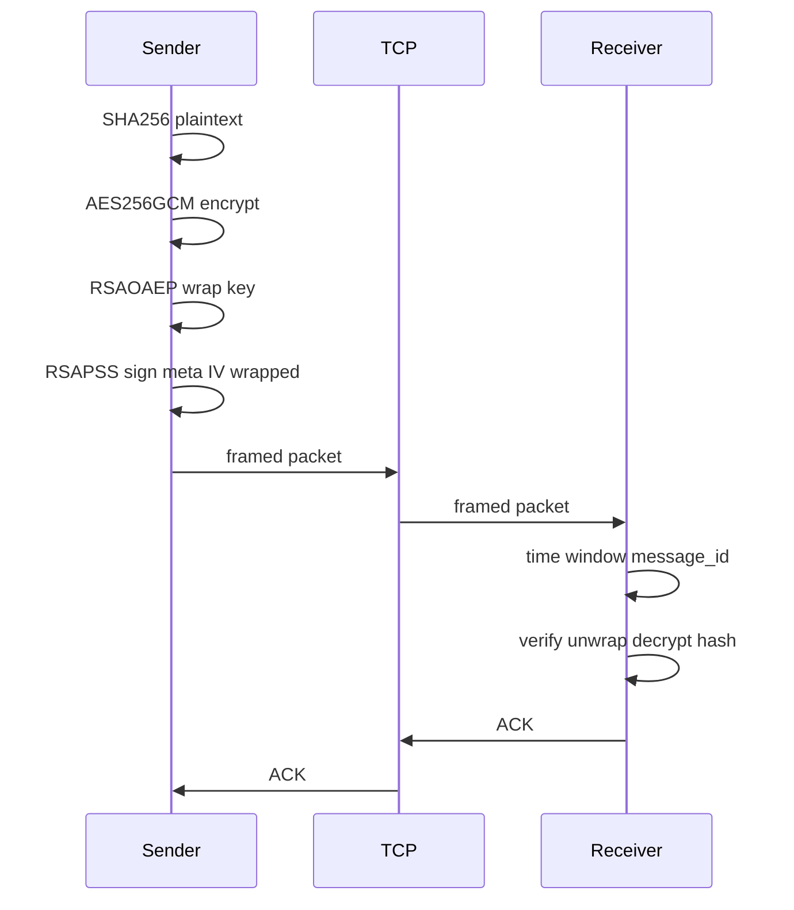

# VSecureTransfer

Защищённая передача одного видеофайла по TCP: **конфиденциальность** (AES-256-GCM), **целостность** (SHA-256 исходника + AEAD), **аутентичность** (RSA-PSS подпись канонических полей и RSA-OAEP обёртка сеансового ключа). Проект учебный / демонстрационный, без PKI и без потокового стриминга.

[](https://en.cppreference.com/w/cpp/17)
[](https://www.openssl.org/)
[](LICENSE)

## Возможности

| Свойство | Реализация |
|----------|------------|
| Шифрование полезной нагрузки | AES-256-GCM (IV 12 байт, tag 16 байт) |
| Хэш исходного файла | SHA-256 в метаданных, пересчёт после расшифрования |
| Сеансовый ключ | Случайные 32 байта, упаковка **RSA-OAEP** (SHA-256 + MGF1-SHA256) открытым ключом **получателя** |
| Подпись отправителя | **RSA-PSS** (SHA-256, salt = digest length) над `meta ‖ IV ‖ wrapped_key` |
| Транспорт | TCP: `uint64` big-endian длина кадра, затем тело; ответ **ACK** 8 байт (`VACK` + код) |
| Анти-replay | Окно времени ±300 с по `unix_timestamp_ms` и учёт `message_id` (16 байт) в файле `--seen-file` |

Поддерживаемые расширения имён файлов на отправителе: `.mp4`, `.avi`, `.mkv`.

## Архитектура



Спецификация бинарного протокола v1 описана в комментариях к [`include/vsecure/protocol.hpp`](include/vsecure/protocol.hpp).

## Сборка

### Зависимости

- Компилятор с **C++17** (Clang, GCC, MSVC).
- **OpenSSL 3.x** (libcrypto; заголовки `openssl/evp.h`, `openssl/pem.h`, …).

### Вариант A: Makefile (macOS / Homebrew)

```bash
export OPENSSL_PREFIX=/opt/homebrew/opt/openssl@3   # при необходимости
make -j
```

### Вариант B: CMake

```bash
cmake -S . -B build -DCMAKE_BUILD_TYPE=Release
cmake --build build -j
# исполняемые файлы: build/vsecure_sender, build/vsecure_receiver
```

На macOS `CMakeLists.txt` пытается подставить `OPENSSL_ROOT_DIR` из типичных путей Homebrew.

## Ключи

Сгенерируйте **две** пары RSA (отдельно для подписи отправителя и для обёртки AES у получателя):

```bash
./scripts/gen_keys.sh
```

Появятся файлы в `keys/` (каталог в `.gitignore` — **не коммитьте** ключи):

| Файл | Кто использует |
|------|----------------|
| `sender_sign_priv.pem` | Отправитель (подпись) |
| `sender_sign_pub.pem` | Получатель (проверка подписи) |
| `receiver_wrap_pub.pem` | Отправитель (OAEP-wrap AES-ключа) |
| `receiver_wrap_priv.pem` | Получатель (OAEP-unwrap) |

Эквивалент вручную через `openssl genpkey` / `openssl pkey` описан в [`scripts/gen_keys.sh`](scripts/gen_keys.sh).

## Запуск

**Терминал 1 — получатель:**

```bash
./vsecure_receiver --port 9000 --out-dir ./out \
  --sender-pub keys/sender_sign_pub.pem \
  --recv-priv keys/receiver_wrap_priv.pem
```

**Терминал 2 — отправитель:**

```bash
./vsecure_sender --file ./video.mp4 --host 127.0.0.1 --port 9000 \
  --sign-key keys/sender_sign_priv.pem \
  --recv-pub keys/receiver_wrap_pub.pem
```

Опционально: `--seen-file ПУТЬ` у получателя (по умолчанию `./out/.vsecure_seen`).

### Отладка / QA

Если задана переменная окружения `VSECURE_DUMP_PACKET=/path/to/file.bin`, отправитель дополнительно сохранит **сырое** тело пакета (без TCP-длины) — используется в [`scripts/test_replay_packet.sh`](scripts/test_replay_packet.sh).

## Тесты

| Скрипт | Назначение |
|--------|------------|
| [`scripts/run_all_tests.sh`](scripts/run_all_tests.sh) | Базовый round-trip + отклонение мусорного кадра |
| [`scripts/qa_full.sh`](scripts/qa_full.sh) | Полный регресс: сборка, базовые тесты, ~4 MiB файл, replay, неверный ключ подписи |

```bash
./scripts/qa_full.sh
```

Требуются `bash`, `make`, `python3`, `openssl`, утилиты `dd`/`head`, `cmp`.

## Коды ACK (ответ получателя)

Константы в `protocol.hpp`: успех `0`, некорректный формат `1`, неверная подпись `2`, повтор `message_id` `3`, сдвиг времени `4`, несовпадение хэша `5`, ошибка расшифрования `6`, ошибка I/O `7`, ошибка соединения `8`.

## Ограничения и безопасность

- Один клиент на запуск получателя; нет интерактивного обмена ключами — только заранее выданные PEM.
- Нет защиты от **утечки метаданных** по размеру/имени файла; нет forward secrecy между сеансами.
- Для production понадобились бы TLS поверх TCP, политика ключей, лимиты размера пакета, таймауты сокетов и аудит.

## Репозиторий

Исходный код: [github.com/paulhowever/VSecureTransfer](https://github.com/paulhowever/VSecureTransfer)

---

*Криптография реализована через EVP API OpenSSL 3; не используйте устаревшие низкоуровневые вызовы в своих форках без необходимости.*
